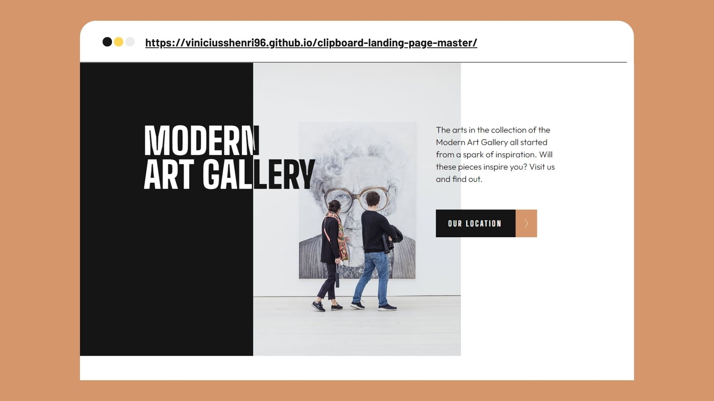

<h1 align="center"> 
    Art gallery website   
    

    
</h1>

<h4 align="center"> 
	🚧 Art gallery website 🟢 Concluído 🚀 🚧
</h4>

<!-- 

 <a href="#-Projeto">Sobre</a> •
 <a href="#-funcionalidades">Funcionalidades</a> •
 <a href="#-descricao">Descrição</a> •
 <a href="#-layout">Layout</a> •
 <a href="#-tecnologias">Tecnologias</a> •
 <a href="#-autor">Autor</a>

 -->

- [Project](#project)
- [About](#about)
- [Functionalities](#functionalities)
- [Layout](#layout)
  - [Mobile](#mobile)
  - [Tablet](#tablet)
  - [Desktop](#desktop)
- [Technologies](#technologies)
- [Author](#author)

---

## **Project**

_Art gallery website_ - Two page art gallery project.

&nbsp;

## **About:**

This project is a challenge of the two-page Mentor frontend site, where as one of the objectives was to leave the layout adaptable for all types of screen (responsive) and i also used Leaflet JS to create an interactive location map with custom location pin.

---

## **Functionalities**

- [x] Responsive
- [x] interactive location map with custom location pin
- [x] Focus states for interactive elements(hover)

---

## **Layout**

### Mobile

  
    

### Tablet

   
     

### Desktop

  
    

---

## **Preview Site**

- [GitPages](https://viniciusshenri96.github.io/art-gallery-website/)

---

## **Technologies**

The following tools were used in building the project:

#### **Website**

- **[HTML](https://developer.mozilla.org/pt-BR/docs/Web/HTML)**
- **[CSS](https://developer.mozilla.org/pt-BR/docs/Web/CSS)**
- **[JavaScript](https://developer.mozilla.org/pt-BR/docs/Web/JavaScript)**
- **[Media queries](https://developer.mozilla.org/pt-BR/docs/Web/JavaScript)**

#### **Utilities**

- Figma
- Fontes: **[Big Shoulders Display, Outfit]()**

---

## **Author**

<a href="https://www.frontendmentor.io/profile/viniciusshenri96">
  <!--  -->
 <h2 style="font-style: normal; color:">Vinícius Henrique</>
   
 </a>

<!--   -->

<!-- ## 📝 Licença

Este projeto esta sobe a licença [MIT](./LICENSE).

Feito com ❤️ por Thiago Marinho 👋🏽 [Entre em contato!](https://www.linkedin.com/in/tgmarinho/)

---

## Versões do README

[Português 🇧🇷](./README.md) | [Inglês sem emojis 🇺🇸](./README-en.md) | [Portugues sem logo 🇧🇷](./README-sem-logo.md) -->
