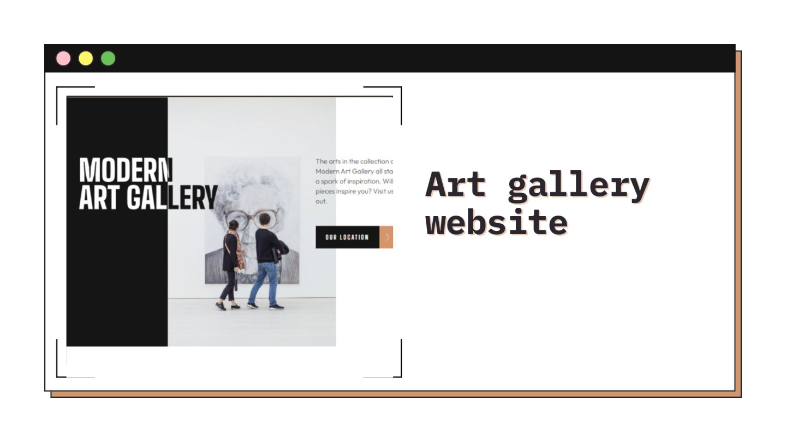
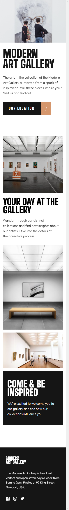
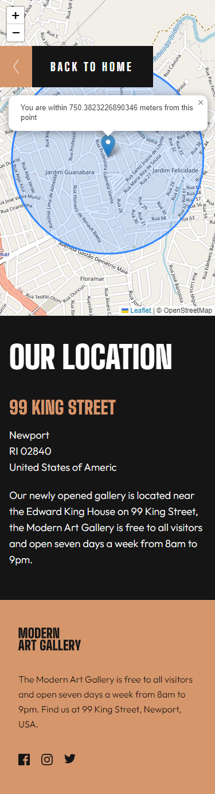
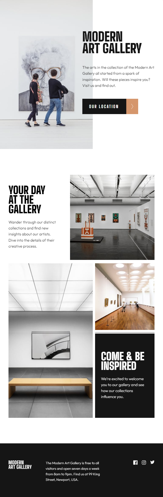
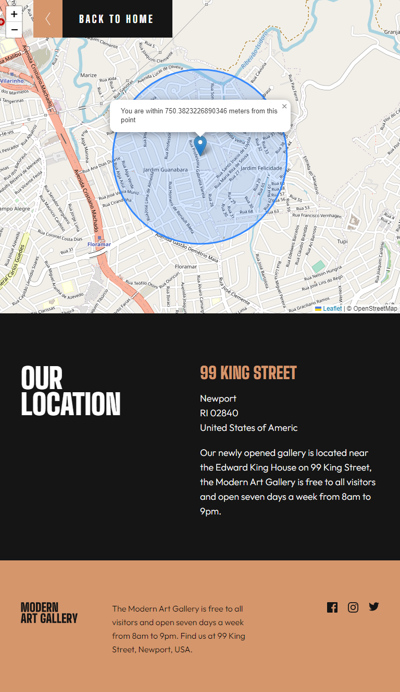
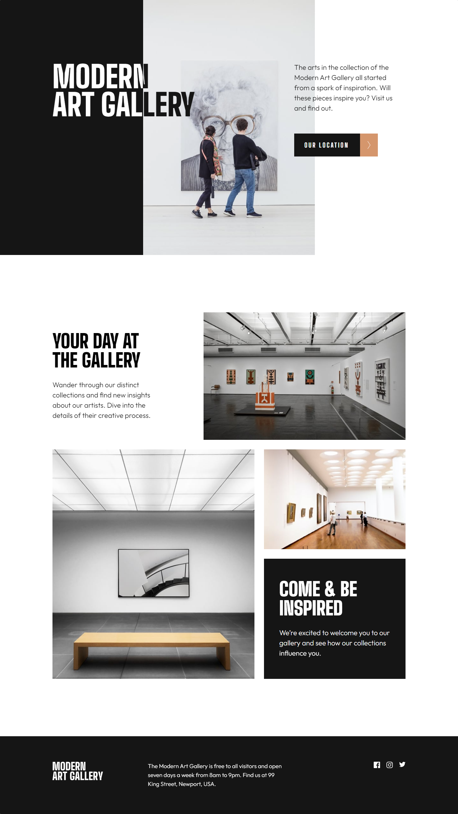
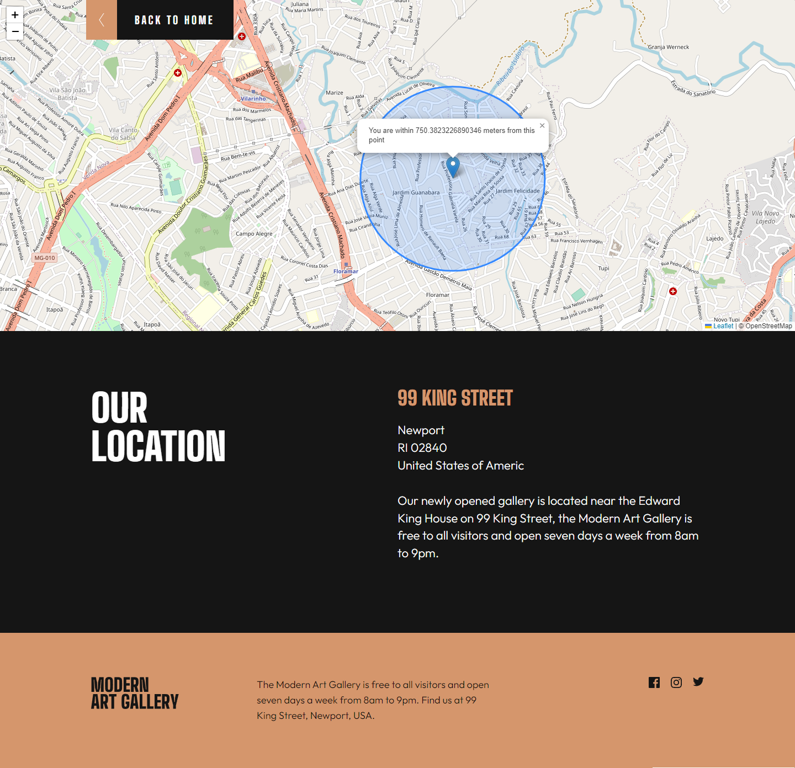

<h1 align="center">Art gallery website</h1>



<h2 align="center"> 
	🚧 Art gallery website 🟢 Completed 🚀 🚧
</h2>

&nbsp;

<!--
## Table of contents

- [Project description](#description) - [What I learned](#What-I-learned) -->

&nbsp;

<h2 id="#description">Project description 📚</h2>

This is a solution to the challenge
[Art gallery website](https://www.frontendmentor.io/challenges/art-gallery-website-yVdrZlxyA).

This project is a challenge of the two-page Mentor frontend site, where as one of the objectives was to leave the layout adaptable for all types of screen (responsive) and i also used Leaflet JS to create an interactive location map with custom location pin.

<a href="https://www.frontendmentor.io/challenges?difficulties=4"></a>

&nbsp;

## What I learned

I used an API intersection watcher to do the Revealing Elements on Scroll effect, just to practice.

```js
const section = document.querySelector(".section-gallery");

const revealSection = function (entries, observer) {
  const [entry] = entries;

  if (!entry.isIntersecting) return;

  entry.target.classList.remove("section-hidden");

  observer.unobserve(entry);
};

const sectionObserve = new IntersectionObserver(revealSection, {
  root: null,
  threshold: 0.15,
});

section.classList.add("section-hidden");
sectionObserve.observe(section);
};
```

And with the geolocation API I can get the user's current location on the map

```js
navigator.geolocation.getCurrentPosition(
  function (position) {
    const { latitude } = position.coords;
    const { longitude } = position.coords;

    const coords = [latitude, longitude];

    const map = L.map("map").setView(coords, 17);


```

## Links

- [Preview Site](https://your-live-site-url.com)
- [Frontend Mentor Solution Page](https://www.frontendmentor.io/solutions/challenge-completed-with-htmlcssleaflet-jsgrid-and-responsive--kw3kKedNp)

&nbsp;

## My process

### Built with

- [HTML](https://developer.mozilla.org/en-US/docs/Web/HTML)
- [CSS](https://developer.mozilla.org/en-US/docs/Web/CSS)
- [Flexbox](https://css-tricks.com/snippets/css/a-guide-to-flexbox/)
- [CSS Grid](https://css-tricks.com/snippets/css/complete-guide-grid/)
- [Vanilla Js](http://vanilla-js.com)
- [Library leaflet js](https://leafletjs.com)

&nbsp;

## Responsive 📱

### Mobile - 375px

<p align="left">

  
    

</p>

### Tablet - 768px

<p align="left">
   
     

</p>

### Desktop - 1440px

<p align="left">
  
    

</p>

## 👨‍💻 Author

- [Frontend Mentor](https://www.frontendmentor.io/profile/viniciusshenri96)
- [Linkedin](https://www.linkedin.com/in/vinícius-henrique-7a2533229/)
